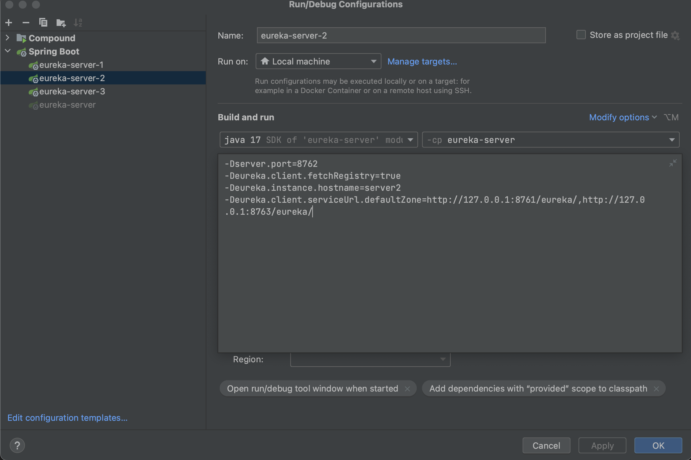
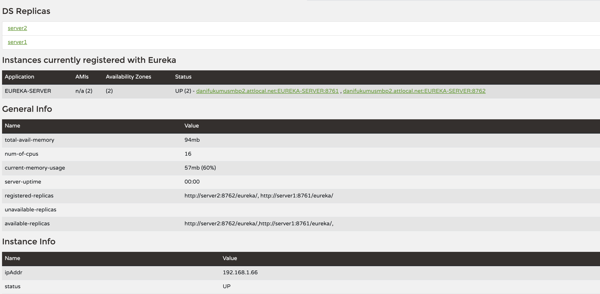

# Getting Started


## Tutorial

### Eureka - Server 

Add dependency
```xml
<dependency>
    <groupId>org.springframework.cloud</groupId>
    <artifactId>spring-cloud-starter-netflix-eureka-server</artifactId>
</dependency>
```

Add annotation in main class
```java
package com.jstp.eurekaserver;

import org.springframework.boot.SpringApplication;
import org.springframework.boot.autoconfigure.SpringBootApplication;
import org.springframework.cloud.netflix.eureka.server.EnableEurekaServer;

@SpringBootApplication
@EnableEurekaServer
public class Application {
    public static void main(String[] args) {
        SpringApplication.run(Application.class, args);
    }
}

```

Config Eureka in `application.yaml`

```yml
eureka:
  client:
    fetch-registry: false
    register-with-eureka: false
server:
  port: 8761

spring:
  application:
    name: EUREKA-SERVER
```


## Optional HA - Eureka Cluster

Develop 3 eureka server instances to form a cluster. Each instance register to each other.

Create 3 applications from one module and change the vm options as followngs:
```
Eureka - 1
-Dserver.port=8761
-Deureka.client.fetchRegistry=true
-Deureka.instance.hostname=server1
-Deureka.client.serviceUrl.defaultZone=http://127.0.0.1:8762/eureka/,http://127.0.0.1:8763/eureka/

Eureka - 2
-Dserver.port=8762
-Deureka.client.fetchRegistry=true
-Deureka.instance.hostname=server2
-Deureka.client.serviceUrl.defaultZone=http://127.0.0.1:8761/eureka/,http://127.0.0.1:8763/eureka/

Eureka - 3
-Dserver.port=8763
-Deureka.client.fetchRegistry=true
-Deureka.instance.hostname=server3
-Deureka.client.serviceUrl.defaultZone=http://127.0.0.1:8761/eureka/,http://127.0.0.1:8762/eureka/

```


---

If replicas show unavailable, following 2 steps should be performed to fix the issue

Modify `private/etc/hosts` contend by adding following
```
# HA Eureka Setup
127.0.0.1 server1
127.0.0.1 server2
127.0.0.1 server3
```

Modify VM options with `hostname` like `server1` instead of `127.0.0.1` 

```
Eureka - 1
-Dserver.port=8761
-Deureka.client.fetchRegistry=true
-Deureka.instance.hostname=server1
-Deureka.client.serviceUrl.defaultZone=http://server2:8762/eureka/,http://server3:8763/eureka/

Eureka - 2
-Dserver.port=8762
-Deureka.client.fetchRegistry=true
-Deureka.instance.hostname=server2
-Deureka.client.serviceUrl.defaultZone=http://server1:8761/eureka/,http://server3:8763/eureka/

Eureka - 3
-Dserver.port=8763
-Deureka.client.fetchRegistry=true
-Deureka.instance.hostname=server3
-Deureka.client.serviceUrl.defaultZone=http://server1:8761/eureka/,http://server2:8762/eureka/
```

---


## Common Q&A

Q: When redirect request from gateway, request auto add service name in the request. For example, expecting redirect to `/orders`, but redirect to `/ORDER-SERVICE/orders`
A: Add following config in gateway application.yaml to strip 1st level
```yaml
spring:
  application:
    name: GATEWAY-SERVICE

  cloud:
    gateway:
      routes:
        - id: ORDER-SERVICE
          uri: lb://ORDER-SERVICE/ # service name
          predicates:
            - Path=/order-service/** # url pattern
          filters:
            - StripPrefix=1
```

Reference: 
+ https://docs.spring.io/spring-cloud-gateway/reference/spring-cloud-gateway/gatewayfilter-factories/stripprefix-factory.html
+ + https://cloud.spring.io/spring-cloud-gateway/reference/html/#gatewayfilter-factories


Q: My service is registered as uppercase, but spring cloud gateway auto converts to lower case during route matching causing service not found
A: add following config
```yaml
spring:
  application:
    name: GATEWAY-SERVICE

  cloud:
    gateway:
      routes:
        - id: ORDER-SERVICE
          uri: lb://ORDER-SERVICE/ # service name
          predicates:
            - Path=/order-service/** # url pattern
          filters:
            - StripPrefix=1
      discovery:
        locator:
          lower-case-service-id: false # lowercase set as false
```
Reference:
+ https://stackoverflow.com/questions/73674870/spring-cloud-api-gateway-spring-cloud-gateway-discovery-locator-lower-case-ser
